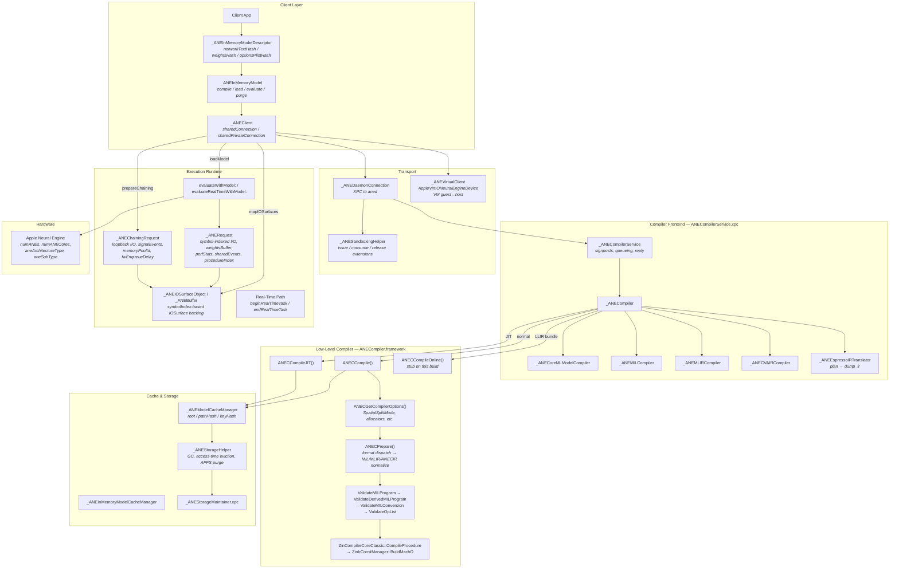
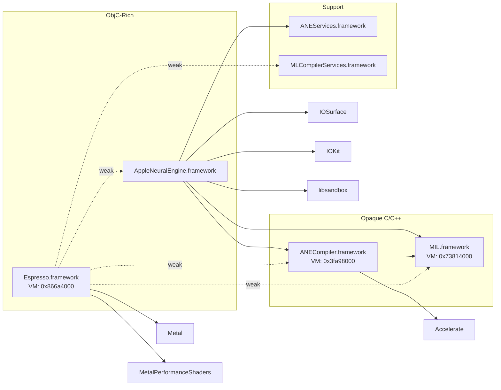

# Apple Neural Engine: Host-Side Architecture Map & Comprehensive Analysis

Synthesized from 25 reverse-engineering files in `results/ane_host_2026-03-22/`, covering `ipsw-safe` extraction and 16 Hopper disassembly validation passes against macOS 26.3 binaries.

---

## End-to-End Architecture Map



---

## Compiler Pipeline Map (Inside `ANECompiler.framework`)

```mermaid
graph LR
    subgraph "Inputs"
        MIL_FILE["MIL file"]
        MLIR_FILE["MLIR file"]
        ANECIR_FILE["ANECIR file"]
    end

    subgraph "Stage 1: Parse"
        GCI["ANECGetCompilerInputs"]
        GCO["ANECGetCompilerOptions<br/><i>SpatialSplitMode, TargetArch,<br/>MaxSegmentSize, allocators…</i>"]
    end

    subgraph "Stage 2: Prepare"
        PREP["ANECPrepare"]
        MIL_PREP["CreatePrepareInfoFromMILFile<br/>→ CreateMILAndConvert"]
        MLIR_PREP["CreatePrepareInfoFromMLIR"]
        ANECIR_PREP["CreatePrepareInfoFromANECIR"]
    end

    subgraph "Stage 3: Validate"
        VAL_MIL["ValidateMILProgram"]
        VAL_DERIVED["ValidateDerivedMILProgram<br/><i>mutable-weight symbols,<br/>live-I/O memory footprint,<br/>weight-file size limits</i>"]
        VAL_CONV["ValidateMILConversion"]
        LIVE_IN["ConvertLiveInputs"]
        OP_LIST["ValidateOpList<br/><i>GetMILConversionMaps() registry:<br/>~150 op handlers</i>"]
        LIVE_OUT["ConvertLiveOutputs"]
    end

    subgraph "Stage 4: Compile"
        ZIN_COMP["ZinCompilerCoreClassic::<br/>CompileProcedure"]
        MACHO["ZinIrConstManager::BuildMachO"]
        EMIT["ANECHandleProgramKernelsAndMetadataToFile"]
    end

    MIL_FILE --> GCI --> GCO --> PREP
    MLIR_FILE --> GCI
    ANECIR_FILE --> GCI

    PREP --> MIL_PREP
    PREP --> MLIR_PREP
    PREP --> ANECIR_PREP

    MIL_PREP --> VAL_MIL --> VAL_DERIVED --> VAL_CONV
    VAL_CONV --> LIVE_IN --> OP_LIST --> LIVE_OUT

    LIVE_OUT --> ZIN_COMP --> MACHO --> EMIT
```



---

## Key Subsystem Details

### 1. Model Identity — Two Distinct Layers

| Layer | Key Fields | Purpose |
|---|---|---|
| **Descriptor (content)** | `networkTextHash`, `weightsHash`, `optionsPlistHash` | Content-based: "is this the same model structurally?" |
| **Model/Cache (location)** | `cacheURLIdentifier`, `sourceURL`, `identifierSource`, `string_id` | Location-based: "which cache slot does this map to?" |

**`identifierSource` enum** (Hopper-confirmed):

| Value | Name | Semantics |
|---|---|---|
| `1` | *(default, name unrecovered)* | Normal model-URL + key |
| `2` | `_ANEModelIdentifierSourceURLAndKey` | Source URL + key; requires non-nil `sourceURL` |
| `3` | `_ANEModelCacheURLIdentifierSource` | Cache-URL-identifier mode; requires non-nil `cacheURLIdentifier` |

> [!IMPORTANT]
> Descriptor identity is content-hash-based. Weight keys are **sorted** before hashing. Unstable MIL text, weight ordering, or options plist serialization **will defeat cache reuse**.

---

### 2. Compilation — Three-Way Compiler Split + Rich Internal Pipeline

**Top-level dispatch** (via `_ANECompiler`):

| Path | Trigger | Low-Level Call |
|---|---|---|
| **Normal** | Any non-JIT, non-LLIR model | `ANECCompile()` |
| **JIT** | Model flagged as JIT (separate `NetworkJITShapesName/Path` dict) | `ANECCompileJIT()` |
| **Online** | Filename is exactly `model.llir.bundle` | `ANECCompileOnline()` (stub on current build) |

**Frontend compilers** (selected via `kANEFModelTypeKey`): `CoreML`, `MIL`, `MLIR`, `ANECIR`, `LLIRBundle`, Espresso.

**Internal pipeline for normal compile:**

1. `ANECGetCompilerInputs` → gather raw file/path inputs
2. `ANECGetCompilerOptions` → parse option dictionary (22KB function, 1201 blocks)
3. `ANECPrepare` → format dispatch → `CreateMILAndConvert` / `CreatePrepareInfoFromMLIR` / `CreatePrepareInfoFromANECIR`
4. `ValidateMILProgram` → `ValidateDerivedMILProgram` → `ValidateMILConversion` → `ValidateOpList`
5. `ZinCompilerCoreClassic::CompileProcedure` → `BuildMachO` → emit to file
6. Mark output purgeable on APFS, propagate dates, optionally create retain marker

**`SpatialSplitMode`** values (decompiled from options parser):
`Memory`, `Auto`, `Test`, `GenericDAG`, `GenericDAGExperimental`, `GenericDAGMemory`, `Disabled`

Manual spatial split structure: `SpatialSplitSubgraphs = [{ HTileCount, InputNodes, OutputNodes }, ...]`

---

### 3. MIL Conversion Bridge — `CreateMILAndConvert`

This is the actual MIL-to-internal bridge (3500 bytes, 145 blocks). It:

- Creates a MIL context with custom ANE opsets (`MIL::Opsets::Custom::ane`)
- Parses MIL text via `MIL::Text::ParseProgramFromFile`
- Extracts **mutable-weight path→symbol mappings** (stable symbolic identity)
- Extracts **source/provenance metadata** (filtered, excludes `BlobFileMutabilityInfo` and `ANEBinaryPoint`)
- Handles flexible shapes: enumerates shapes, transforms programs, **recursively re-enters itself** for shape-specialized variants
- Produces per-procedure `ANECProcedureInfo` vectors

> [!NOTE]
> MIL blob files enforce **0x40-byte alignment** for offsets. Deterministic weight layout matters for cache reuse.

---

### 4. Op-Level Validation — `ValidateOpList` and the Conversion Map Registry

`ValidateOpList` (7164 bytes, 301 blocks) is the semantic center. It uses `GetMILConversionMaps()` — a **hard-coded registry of ~150 MIL operation handlers**:

````carousel
**Buffer / I/O / Boundary:**
`tensor_buffer_to_tensor`, `tensor_to_tensor_buffer`, `circular_buffer_to_tensor`, `tensor_to_circular_buffer`, `pixel_buffer_to_tensor`, `tensor_to_pixel_buffer`

**Activations:**
`relu`, `gelu`, `silu`, `sigmoid`, `softmax`, `elu`, `leaky_relu`, `prelu`, `tanh`, `softplus`, `softsign`, `clamped_relu`, `scaled_tanh`, `sigmoid_hard`, `thresholded_relu`, `relu6`

**Math/Logic:**
`abs`, `exp`, `log`, `sqrt`, `rsqrt`, `sin`, `cos`, `ceil`, `floor`, `round`, `sign`, `square`, `clip`, `pow`, `add`, `sub`, `mul`, `real_div`, `floor_div`, `mod`, `maximum`, `minimum`, `equal`, `greater`, `less`, `logical_and/or/xor/not`
<!-- slide -->
**Conv / MatMul / Pooling / Norm:**
`conv`, `conv_transpose`, `linear`, `matmul`, `einsum`, `batch_norm`, `instance_norm`, `layer_norm`, `l2_norm`, `local_response_norm`, `avg_pool`, `max_pool`, `l2_pool`

**Reshape / Layout:**
`reshape`, `transpose`, `concat`, `split`, `squeeze`, `expand_dims`, `stack`, `flatten2d`, `slice_by_index`, `slice_by_size`, `pixel_shuffle/unshuffle`, `space_to_depth/batch`, `depth_to_space`, `batch_to_space`

**Constant / Quantization:**
`const`, `constexpr_affine_dequantize`, `constexpr_lut_to_dense`, `constexpr_sparse_to_dense`, `constexpr_blockwise_shift_scale`, `constexpr_sparse_blockwise_shift_scale`, `constexpr_lut_to_sparse`, `constexpr_cast`, `quantize`, `dequantize`
<!-- slide -->
**Gather / Scatter / Resize / Geometry:**
`gather`, `gather_along_axis`, `gather_nd`, `scatter`, `scatter_along_axis`, `scatter_nd`, `crop`, `crop_resize`, `resize`, `resize_bilinear`, `resize_nearest_neighbor`, `upsample_bilinear`, `upsample_nearest_neighbor`, `affine`, `resample`, `reverse`, `reverse_sequence`, `sliding_windows`

**Control Flow / State / List:**
`call`, `cond`, `while_loop`, `write_state`, `read_state`, `make_list`, `list_length`, `list_read`, `list_write`, `list_gather`, `list_scatter`, `slice_update`

**ANE / PE / Custom:**
`scaled_dot_product_attention`, `ne_conv`, `ne_matmul`, `ne_pool`, `ne_bypass`, `pe_pool`, `pe_elementwise`, `pe_goc`

**Reduction / Random / Misc:**
`reduce_argmax/min`, `reduce_mean/sum/max/min/prod`, `argsort`, `topk`, `cumsum`, `fill`, `pad`, `tile`, `one_hot`, `non_zero`, `band_part`, `range_1d`, `non_maximum_suppression`
````

Width failures are **localized to specific lowering passes**, not a single global limit:
- `TransposeLayerUtils::ValidateTransposeMappings` → width-divisibility by 2/3/4/8
- `ZinMirSpatialArgMinMax::InsertGenericPooling` → "split into multiple-of-8 + remainder"

---

### 5. Fused SDPA Path — `MILOpConverter::SDPA`

Apple has a **fully dedicated fused SDPA conversion path** (3372 bytes, 84 blocks):

- Distinguishes inputs semantically: `query`, `key`, `value`, optional `attn_mask`
- Builds dedicated layout conversions: `__@convert_query_layout`, `__@convert_key_layout`, etc.
- Expected layouts: rank 3 → `NCW`, rank 4 → `NHCW`
- **Compiler injects the scale constant** as `1/√dim` in Fp16 — not from user input
- Lowers into dedicated `ZinIrSDPAUnitInfo` → `ZinIrSDPAUnit` → `ZinSDPALayer::Lower`
- Has own validation: `ZinSDPALayer::ValidateSemantics_Impl` and `_ANECValidateSDPALayer`

> [!IMPORTANT]
> Apple's fused SDPA is not just syntactic sugar — it has its own layout assumptions, scale materialization, and unit type. Comparing it against hand-expanded graphs would be a meaningful experiment.

---

### 6. Cache Lifecycle

```
Compile succeeds
  → move temp artifact to cache dir (root/pathHash/keyHash/)
  → mark artifact + parent as APFS-purgeable
  → propagate source file dates
  → save source model path
  → optionally create retain marker
```

**Cache root selection:** sharing entitlement or system model → `systemModelsCacheDirectory`; otherwise → per-bundle-ID directory.

**GC rules** (Hopper-confirmed from `_ANEStorageHelper`):
1. Source path still exists → **keep**
2. Source gone, retain marker exists, access < 7 days → **keep**
3. Otherwise → **delete** entire model directory

Cache identifiers are **reversible path encodings** (`_` ↔ `/`).

---

### 7. Execution Runtime

**`_ANERequest` object layout** (Hopper-confirmed):

| Offset | Field | Notes |
|---|---|---|
| `+0x08` | `inputArray` | Input IOSurface objects |
| `+0x10` | `inputIndexArray` | **Symbol indices** |
| `+0x18` | `outputArray` | Output IOSurface objects |
| `+0x20` | `outputIndexArray` | Symbol indices |
| `+0x28` | `weightsBuffer` | Optional per-request weight IOSurface |
| `+0x30` | `sharedEvents` | Optional shared event objects |
| `+0x38` | `transactionHandle` | Optional transaction handle |
| `+0x40` | `procedureIndex` | Which procedure (max 128) |
| `+0x48` | `perfStats` | Mutable runtime stats handle |
| `+0x50` | `perfStatsArray` | Constructor-supplied stats spec |
| `+0x58` | `completionHandler` | Completion callback |

**Hard limits:** max buffers: 255, max symbol index: 254, max procedures: 128, max signal events: 64.

**Chaining** (`_ANEChainingRequest`): loopback I/O, up to 256 signal events, up to ~12 output sets, `memoryPoolId`, `fwEnqueueDelay`. Not supported on virtual client path.

**Real-time:** a distinct mode with `beginRealTimeTask`/`endRealTimeTask` session boundaries, separate load/evaluate/unload APIs, and dedicated `aneRealTimeTaskQoS`.

---

### 8. Framework Dependency Map



**Espresso** is the bridge layer — it owns `compile_network_to_cache_url_identifier`, `create_ane_request`, and `build_segment`. It is where MIL-derived artifacts → ANE cache identifiers → `_ANERequest` assembly happens.

---

## Compiler Option Keys Discovered

| Key | Purpose |
|---|---|
| `SpatialSplitMode` | `Memory` / `Auto` / `GenericDAG` / `Disabled` etc. |
| `SpatialSplitSubgraphs` | Manual split: `[{HTileCount, InputNodes, OutputNodes}]` |
| `TargetArchitecture` | Target architecture string |
| `MaxSegmentSize` | Segment size limit |
| `MaxTdCount` | Thread descriptor count limit |
| `DramAllocatorType` | `FirstFitReuse` / `BestFitReuse` / `NoReuse` |
| `DramTensorPriorityType` | `costofreads` / `sizebyliverange` etc. |
| `L2AllocatorType` / `L3AllocatorType` | Cache-level allocator selection |
| `DisableContextSwitching` | Disable context switch support |
| `FoldScale` | Scale folding optimization |
| `ProduceRelocatableObjects` | Relocatable object emission |
| `kANEFSkipPreparePhaseKey` | Skip preparation phase |
| `kANEFKeepModelMemoryWiredKey` | Pin model memory |
| `kANEFEnablePowerSavingKey` | Power saving mode |
| `kANEFEnableLateLatchKey` | Late-latch scheduling |
| `kANEFDisableIOFencesUseSharedEventsKey` | Switch IO fences → shared events |
| `kANEFEnableFWToFWSignal` | Firmware-to-firmware signaling |
| `kANEFPerformanceStatsMaskKey` | Perf stats collection bitmask |
| `kANEFRetainModelsWithoutSourceURLKey` | Retain caches even without source |

---

## Implications for `rustane`

### Highest Priority

1. **Compile-cache reuse** — `rustane` likely compiles from fresh temp paths every time, defeating Apple's cache machinery. Stable descriptor construction (MIL text, sorted weight key ordering, stable options plist) is the prerequisite. Cache identifier = `hexString(path) + hexString(key)`.

2. **Fused SDPA experiment** — Apple has a dedicated `MILOpConverter::SDPA` → `ZinIrSDPAUnitInfo` path with its own layout rules and compiler-injected scale constant. Comparing fused SDPA vs. hand-expanded attention graphs on current width-limit problems is a concrete next experiment.

3. **Width constraints are per-pass, not monolithic** — transpose validation requires width divisible by 2/3/4/8; spatial ArgMin/ArgMax requires split into multiple-of-8 + remainder. The compiler has spatial-split options (`SpatialSplitMode`) that may help bypass some limits.

### Second Wave

4. **Request packing** — Apple's runtime uses symbol-indexed I/O with optional per-request weights, perf stats, and shared events. The current `run_cached_direct(&[inputs], &[outputs])` is simpler than what the hardware expects.

5. **Chaining** — first-class multi-procedure execution with loopback and signals. Addresses dispatch overhead, not compile/shape ceilings.

6. **Mutable-weight symbol identity** — Apple's MIL bridge extracts `absolute_path → symbol_name` mappings and validates them. Dynamic weights should have stable symbolic names.

### Confirmed

- `rustane`'s use of `_ANEClient` + `_ANEInMemoryModel` aligns with actual framework objects
- MIL is a first-class IR, not an accident — `MIL.framework` ships separately, `_ANEMILCompiler` is a real class
- Compile failures at `ANECCompile` are real compiler boundary rejections
- Dynamic-shape validation can silently **degrade residency** instead of failing hard (`MarkAllOpsAsInvalid`)
