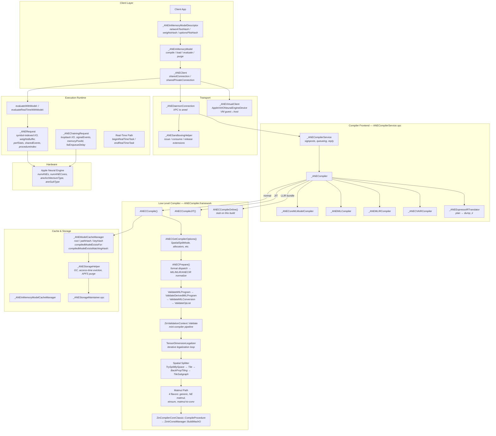
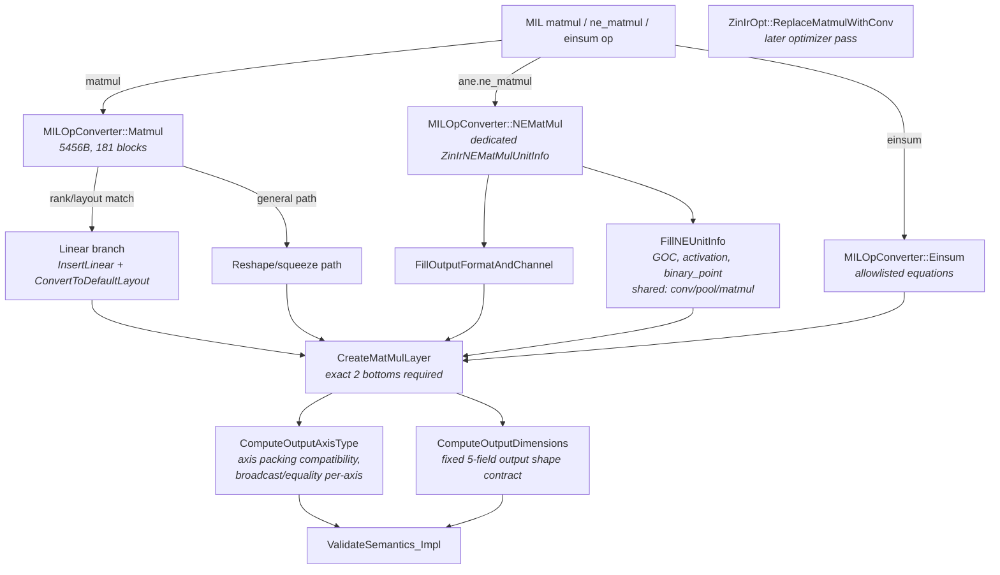
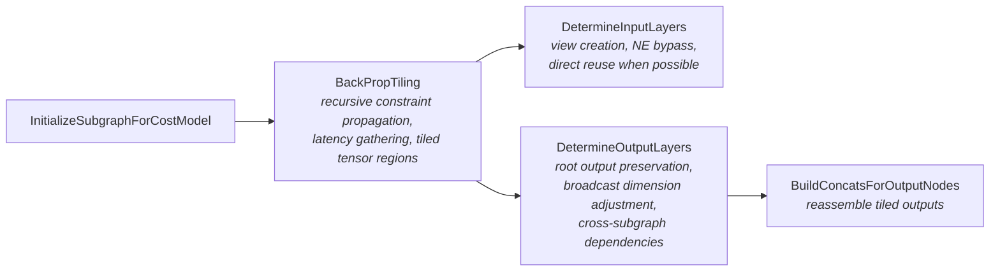

# Apple Neural Engine: Host-Side Architecture Map & Comprehensive Analysis

Synthesized from 51 reverse-engineering files in `results/ane_host_2026-03-22/`, covering `ipsw-safe` extraction and 41 Hopper disassembly validation passes against macOS 26.3 binaries.

---

## End-to-End Architecture Map



---

## Compiler Pipeline (Inside `ANECompiler.framework`)

```mermaid
graph LR
    subgraph "Stage 1: Parse"
        GCI["ANECGetCompilerInputs"]
        GCO["ANECGetCompilerOptions<br/><i>22KB, 1201 blocks</i>"]
    end

    subgraph "Stage 2: Prepare"
        PREP["ANECPrepare"]
        MIL_PREP["CreateMILAndConvert<br/><i>ANE opsets, flex shapes,<br/>mutable weights, recursive</i>"]
    end

    subgraph "Stage 3: Validate"
        VAL["ValidateDerivedMILProgram<br/><i>mutable-weight symbols,<br/>live-I/O BSS budget,<br/>weight-file size limits</i>"]
        OP_LIST["ValidateOpList<br/><i>~150 op handlers via<br/>GetMILConversionMaps()</i>"]
    end

    subgraph "Stage 4: Validation Mini-Compiler"
        MINI["ZinValidationContext"]
        PREPROC["DMA type-cast insertion"]
        DCE["Dead-code elimination"]
        PAD["Pad optimization"]
        FUSE["Layer fusion"]
        ENG["Engine assignment"]
        TDLEGAL["TensorDimensionLegalizer<br/><i>iterative legalization loop</i>"]
    end

    subgraph "Stage 5: Spatial Splitting"
        IDENTIFY["Subgraph identification<br/><i>legality-driven + pressure-driven</i>"]
        STRATEGY["Tile strategy<br/><i>global refinement or<br/>pressure-based</i>"]
        BACKPROP["BackPropTiling<br/><i>recursive constraint propagation</i>"]
        REWRITE["TileSubgraph<br/><i>input/output graph surgery,<br/>concat reassembly</i>"]
    end

    subgraph "Stage 6: Matmul"
        MATMUL["MILOpConverter::Matmul<br/><i>rank 1-4, linear branch,<br/>layout conversion</i>"]
        NEMATMUL["MILOpConverter::NEMatMul<br/><i>dedicated ZinIrNEMatMulUnitInfo</i>"]
        EINSUM["MILOpConverter::Einsum<br/><i>allowlisted equations only</i>"]
        MM_BUILDER["CreateMatMulLayer<br/><i>axis type + dimension derivation</i>"]
        MM_VALID["ValidateSemantics_Impl<br/><i>depth ≤ 1, output-channel,<br/>KMEM capacity</i>"]
    end

    subgraph "Stage 7: Codegen"
        ZIN_COMP["CompileProcedure"]
        MACHO["BuildMachO"]
        EMIT["Emit to file"]
    end

    GCI --> GCO --> PREP --> MIL_PREP --> VAL --> OP_LIST
    OP_LIST --> MINI --> PREPROC --> DCE --> PAD --> FUSE --> ENG --> TDLEGAL
    TDLEGAL --> IDENTIFY --> STRATEGY --> BACKPROP --> REWRITE
    REWRITE --> MATMUL & NEMATMUL & EINSUM
    MATMUL --> MM_BUILDER --> MM_VALID
    NEMATMUL --> MM_BUILDER
    EINSUM --> MM_BUILDER
    MM_VALID --> ZIN_COMP --> MACHO --> EMIT
```



---

## Key Subsystem Details

### 1. Model Identity & Cache — Two Layers (Passes 35-36, 41)

| Layer | Key Fields | Purpose |
|---|---|---|
| **Descriptor (content)** | `networkTextHash`, `weightsHash`, `optionsPlistHash` | "Is this the same model structurally?" |
| **Model/Cache (location)** | `cacheURLIdentifier`, `sourceURL`, `identifierSource`, `string_id` | "Which cache slot?" |

**`identifierSource` enum**: `1` = default URL+key, `2` = `_ANEModelIdentifierSourceURLAndKey`, `3` = `_ANEModelCacheURLIdentifierSource`

**Descriptor construction** (`_ANEInMemoryModelDescriptor init`):
1. Hash network text → `networkTextHash` via `hexStringForData:`
2. **Sort weight keys** → extract first value from each → hash flat array → `weightsHash` via `hexStringForDataArray:`
3. Hash options plist → `optionsPlistHash` via `hexStringForData:`
4. Store `isMILModel` flag

**Model init** (`_ANEModel init`):
- Rejects `cacheURLIdentifier` containing `..` (path traversal guard)
- `identifierSource == 3` requires non-nil `cacheURLIdentifier`
- `identifierSource == 2` requires non-nil `sourceURL`
- `string_id` generated from model path via `kdebug_trace_string()` if not caller-supplied

**Espresso compile-to-cache flow** (pass 36):
1. `key_for_segment(...)` → compute segment key
2. `get_original_url_if_exists(...)` → recover source URL
3. Construct `_ANEModel` with `cacheURLIdentifier: nil`
4. `compileModel:options:qos:error:` → compile
5. `getCacheURLIdentifier` → read back ANEF-assigned cache ID
6. Nil cache ID = hard failure: `"ANERuntimeCompiler: ANEF returned cacheURLIdentifier as nil."`

**Cache lookup** (pass 41) — two daemon-exposed modes:
- `compiledModelExistsFor:withReply:` — exact identity match
- `compiledModelExistsMatchingHash:withReply:` — hash-based match

**Cache path construction** (`_ANEModelCacheManager`):
- `cacheURLIdentifier` present → decode (`_` → `/`)
- Otherwise → `hexString(path) + hexString(key)` path hierarchy
- Cache root: sharing entitlement → system; otherwise → per-bundle-ID
- Stale-binary removal: checks filesystem timestamps, source path existence

> [!IMPORTANT]
> Weight keys are **sorted** before hashing. Unstable MIL text, weight ordering, or options plist serialization will defeat cache reuse. Source URL churn triggers stale-binary eviction.

---

### 2. Matmul Compiler Path — Four Flavors (Passes 34, 37-40)

Apple has **multiple** matmul-related compiler paths, not one monolithic handler:



**Hard semantic constraints** (from `ZinMatrixMultLayer::ValidateSemantics_Impl`):
- Exactly 2 inputs
- Input rank must be 1–4: `"ANE can only support matmul with input tensors rank between 1 and 4"`
- Output channel must equal input A's channel dimension
- Depth must be ≤ 1: `"depth > 1 is not supported for MatMult inputs"`
- Selected dimensions must be 1 or equal to each other
- Output channel of input A must fit in KMEM: `"the output channel of input A (%zu kB) can not fit the Kmem (%zu kB)"`

**Einsum** is equation-allowlisted, not free-form. Known supported: `chk,khq->chq`. Unsupported equations fail: `"Unsupported einsum equation: %s"`.

**`FillNEUnitInfo`** (pass 38) — generic NE-unit metadata shared across conv/pool/matmul:
- `FillNEGOCInfo(...)` — GOC metadata
- `FillActivationInfo(...)` — optional activation
- Optional `binary_point` → stored at unit-info `[0x5a]` with presence flag at `[0x16c]`

**Builder failures** (pass 40) — small concrete functions:
- `ComputeOutputAxisType`: requires compatible axis packing, broadcast/equality per-axis
- `ComputeOutputDimensions`: fixed 5-field contract — `max(A,B)`, preserved dims from A and B

> [!WARNING]
> KMEM capacity is a **hard matmul gate**. Output channel of input A must physically fit kernel memory. This is likely one root cause of large-scale matmul failures in `rustane`.

---

### 3. Fused SDPA Path (Passes 16-18)

Apple has a **fully dedicated fused SDPA** path: `MILOpConverter::SDPA` → `ZinIrSDPAUnitInfo` → `ZinSDPALayer::Lower`.

**Semantic constraints** (from `ValidateSemantics_Impl`):
- 4 inputs (Q, K, V, scale) or 5 (+ mask)
- Q and K must have same embedding size (W dim)
- K and V must have same sequence length (C dim)
- Q, K, V must have same tensor format
- Scale must be constant
- Mask format must match Q/K/V; mask W must match K/V channel; mask C must match Q channel or be broadcastable

**Lowering decomposition** (from `ZinSDPALayer::Lower`):
1. `CreateTranspose` (key path)
2. `CreateMatMulLayer` (Q @ K^T)
3. `CreateConstScaleAndBiasGOC` (compiler-injected `1/√dim` in Fp16)
4. `CreateElementWiseLayer` (mask, if present)
5. `CreateSoftmaxLayer`
6. `CreateMatMulLayer` (attention weights × V)

> [!NOTE]
> SDPA is a semantic convenience with strict constraints. It still decomposes into primitives — but Apple controls the decomposition, layouts, and scale materialization.

---

### 4. Validation Mini-Compiler (Pass 19)

`ZinValidationContext::Validate` builds a temporary single-block graph from each unit and runs a fixed pipeline:

1. **DMA type-cast insertion** — `ZinIrIOInsertTypeCastForDmaConversions`
2. **Composite/layer creation** — forward traversal
3. **Dead-code elimination** — `ZinIrOptDCE`
4. **Layer lowering** — forward traversal
5. **Pad optimization** — `ZinMirPadOptimization::Execute`
6. **Layer fusion** — `ZinMirLayerFusion::Run` (failure: "Layer cannot be fused on ANE")
7. **DMA texture configuration** — forward traversal
8. **Engine assignment** — forward traversal  
9. **PE transpose fusion** — optional, config-gated
10. **Tensor dimension legalization** — `ZinMirTensorDimensionLegalizer::Execute`

> [!IMPORTANT]
> Many "validation" failures are really mini-compiler pipeline failures (fusion, engine assignment, dimension legalization), not just semantic checks.

---

### 5. Spatial Splitting Framework (Passes 20-33)

Apple's spatial splitter is a **full subgraph-optimization framework**, not a local tensor-chunking utility.

#### 5.1 Legalization Loop (`TensorDimensionLegalizer::Execute`)

```
loop:
  clear collected subgraphs
  traverse CFG → identify illegal subgraphs
  if none → validate result → return success
  if found → TrySplitBySpace()
  if split fails → return failure (status 3)
  if subgraphs remain → loop again
```

Spatial splitting is shared across **three** legalization passes:
- `TensorDimensionLegalizer` — shape/dimension violations
- `L2Legalizer` — L2 memory constraints
- `LatencyLegalizer` — latency violations

#### 5.2 Two Split Strategies

| Strategy | Trigger | Method |
|---|---|---|
| **Pressure-based** | Memory pressure exceeds budget | Schedule-aware allocation model, peak vs SIP comparison |
| **Global refinement** | Config bit enabled | Multi-pass: pressure ID → CSE → conv merges → optional re-traversal |

#### 5.3 Subgraph Identification — Two Triggers

**Legality-driven** (`LegalizerSubgraphIdentification::AddSubgraph`):
- Seeds from an illegal layer + split dimension
- Builds structured candidate with participating layers, tile counts, split-alignment constraints

**Pressure-driven** (`PressureBasedSubgraphIdentification`):
- Requires scheduled graph (`Must run scheduler first`)
- Builds memory pressure map via `ZinIrMemoryPressureAnalyzer`
- Tracks allocations: normal tensors, chain buffers, L2 circular buffers
- Identifies high-pressure live-range regions → merge contiguous → expand geometrically (doubling search) → extract clusters → refine

#### 5.4 Pressure Math

| Concept | Meaning |
|---|---|
| **Peak pressure** | Max memory demand over a live range, composed of tensor + chain/L2 + copy/DMA + over-computation pressure |
| **Split-invariant pressure (SIP)** | Pressure remaining even after tiling — structural minimums, DMA buffers, chained roots |
| **Budget test** | If SIP > budget → "Can't tile subgraph b/c SIP > budget" → split rejected |

#### 5.5 Graph Surgery Pipeline



#### 5.6 Cluster Refinement Pipeline

Before a cluster becomes a `Subgraph`, it passes through:
1. **Remove ambiguous boundary inputs** — reject nodes driving both internal and external consumers
2. **Remove illegal internal patterns** — no-ops, unsupported concats
3. **Iterate until fixed point** — repeat cleanup until cluster size stabilizes
4. **Identify I/O boundary nodes** — topological: outside producer → input, outside consumer → output
5. **Extract subgraph** — materialize into `Subgraph` record
6. **Drop pure-input concats** — remove concat scaffolding
7. **Remove trivial pass-through nodes** — nodes that are both input and output boundaries

**Additional policy constraints:**
- **ANE placement**: `ZinClusterConstraintPerAne::CanBeInCluster` — bonded ANE index hints must be compatible
- **Acyclic clusters**: Must construct valid boundary tensors via fork/join analysis; schedule-based cut as fallback
- **Work-unit utilization**: Split rejected if tiles underfill the hardware work unit (HAL threshold at `hal+0x278`)
- **Memory footprint**: Split only accepted if kernel-read reduction outweighs boundary-tensor cost (`original_reads - tiled_reads > 2 × boundary_cost`)
- **Output compression**: Tile count must be compatible with compressed output tensor layout
- **Boundary movement**: Compiler will move the cluster boundary to find coherent splittable dimensions

#### 5.7 `IsWorthTile` — Economic Split Decision

Not just "can I split?" but "should I split?" — combines latency deltas, normalized pressure/cost, copy-layer effects, and ANE-layer status.

---

### 6. Resource Gates

| Gate | Location | What It Checks |
|---|---|---|
| **Live-I/O BSS budget** | `ValidateLiveIOMemoryFootprint` | Aggregate live-in + live-out + live-state tensor bytes vs BSS limit |
| **Weight-file size** | `ValidateDerivedMILProgram` | Materialized weight file bytes vs maximum |
| **SIP > budget** | `ComputeTileSize` | Split-invariant pressure exceeds split budget → no viable tiling |
| **KMEM capacity** | `ValidateSemantics_Impl` | Matmul output channel of input A must fit kernel memory |
| **Width divisibility** | `TransposeLayerUtils` | Width must be divisible by 2, 3, 4, or 8 (transpose-specific) |
| **Spatial ArgMin/ArgMax** | `ZinMirSpatialArgMinMax` | Must split into multiple-of-8 + remainder |
| **MatMul depth** | `ValidateSemantics_Impl` | Depth > 1 rejected for matrix-mult inputs |
| **Work-unit utilization** | `HasWorkUnitUtilizationLossAfterSplit` | Tiles too small for hardware work-unit packing |

---

### 7. Op-Level Validation Registry (~150 ops)

`GetMILConversionMaps()` is a hard-coded registry keyed by op name. Notable families:

| Category | Examples |
|---|---|
| **Attention** | `scaled_dot_product_attention` |
| **Matmul** | `matmul`, `einsum`, `ane.ne_matmul` |
| **ANE/PE native** | `ne_conv`, `ne_matmul`, `ne_pool`, `ne_bypass`, `pe_pool`, `pe_elementwise`, `pe_goc` |
| **Quantization** | `constexpr_affine_dequantize`, `constexpr_blockwise_shift_scale`, `quantize`, `dequantize` |
| **State** | `write_state`, `read_state`, `make_list`, `list_read/write/gather/scatter` |
| **Control flow** | `call`, `cond`, `while_loop` |
| **Buffer boundary** | `tensor_buffer_to_tensor`, `circular_buffer_to_tensor`, `pixel_buffer_to_tensor` |

Per-op-family revalidation exists for: `gather`/`gather_nd`/`gather_along_axis`, `crop_resize`, `resample`.

---

### 8. Compiler Option Keys

| Key | Values / Purpose |
|---|---|
| `SpatialSplitMode` | `Memory` / `Auto` / `Test` / `GenericDAG` / `GenericDAGExperimental` / `GenericDAGMemory` / `Disabled` |
| `SpatialSplitSubgraphs` | Manual: `[{HTileCount, InputNodes, OutputNodes}]` |
| `TargetArchitecture` | Target arch string |
| `MaxSegmentSize` / `MaxTdCount` | Segment/TD limits |
| `DramAllocatorType` | `FirstFitReuse` / `BestFitReuse` / `NoReuse` |
| `DramTensorPriorityType` | `costofreads` / `sizebyliverange` / `sizethenliverange` / `orderofcreation` |
| `L2AllocatorType` / `L3AllocatorType` | Cache-level allocator selection |
| `DisableContextSwitching` | Disable context switch support |
| `FoldScale` / `ProduceRelocatableObjects` | Optimization / object emission flags |

---

### 9. Execution Runtime

**`_ANERequest`**: symbol-indexed I/O, optional `weightsBuffer`, `perfStats`/`perfStatsArray`, `sharedEvents`, `transactionHandle`, `procedureIndex` (max 128), `completionHandler`. Max buffers: 255, max symbol index: 254.

**Chaining** (`_ANEChainingRequest`): loopback I/O, up to 256 signal events, `memoryPoolId`, `fwEnqueueDelay`. Not supported on virtual client path.

**Real-time**: distinct mode with `beginRealTimeTask`/`endRealTimeTask` session boundaries.

---

## Implications for `rustane`

### Highest Priority

1. **Compile-cache reuse** — stable descriptor construction (sorted weight keys, stable MIL text, stable options plist). Cache identifier = `hexString(path) + hexString(key)`. Two lookup modes: exact identity + hash matching. Source URL churn triggers stale-binary eviction.

2. **Matmul shape contract** — rank 1-4, depth ≤ 1, output-channel = input A channel, dimensions must be 1 or equal, **input A output channel must fit KMEM**. This KMEM gate likely explains large-scale matmul failures. The `ComputeOutputAxisType` and `ComputeOutputDimensions` functions are small and concrete.

3. **Fused SDPA experiment** — Apple has a dedicated path with Q/K/V shape constraints, compiler-injected scale, and layout normalization. Comparing fused vs hand-expanded on current width-limit problems is a concrete experiment. Still decomposes into matmul/softmax primitives internally.

4. **Width constraints are per-pass, not monolithic** — transpose validation (divisible by 2/3/4/8), spatial ArgMin/ArgMax (multiple-of-8 + remainder), compressed output tile-count alignment, KMEM capacity (matmul-specific). Spatial-split options (`SpatialSplitMode`) may help bypass some limits.

### Second Wave

5. **Spatial-splitting framework** — Apple's splitter does pressure-aware subgraph identification, latency-based tile optimization, recursive constraint propagation, and graph surgery with view/bypass/concat plumbing. The repo's manual kernel decomposition solves one slice of this problem.

6. **Multiple matmul flavors** — generic (with linear branch), dedicated `ane.ne_matmul` (with NE-specific unit-info), einsum (equation-allowlisted), and a later matmul-to-conv rewrite optimizer. Steering MIL toward the right flavor may affect acceptance.

7. **Request packing** — Apple uses symbol-indexed I/O with optional per-request weights and perf stats. Current `run_cached_direct` is simpler than what the hardware expects.

8. **Mutable-weight symbol identity** — Apple extracts `absolute_path → symbol_name` bindings at MIL conversion and validates them. Dynamic weights should have stable symbolic names.

### Confirmed

- `rustane`'s `_ANEClient` + `_ANEInMemoryModel` aligns with actual framework objects
- MIL is first-class — `MIL.framework` ships separately, `_ANEMILCompiler` is real
- Compile failures at `ANECCompile` are real compiler boundary rejections
- Validation is a mini-compiler pipeline, not just semantic checks
- Cache identity is compile-produced (`getCacheURLIdentifier` after `compileModel:`)
